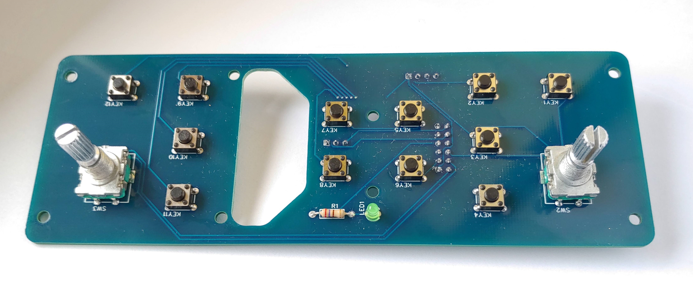
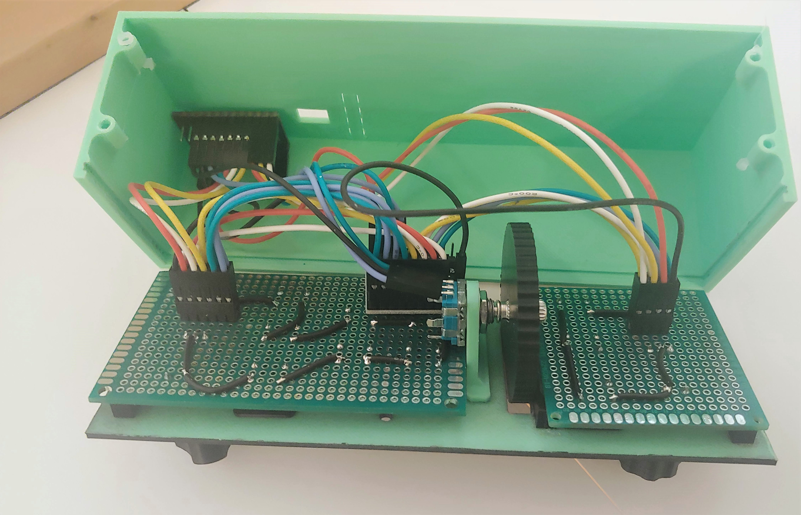

# open AutopilotPanel
A 3D printable autopilot panel for Microsoft Flightsimulator modeled after the Garmin GFC 500

## Features
* 3 Rotary Encoder (HDG / ALT / VS up/down)
* 12 Pushbuttons
* Emulates a standard gamecontroller (no additional software needed)

## Uses Materials
 * 1 [Arduino Pro Micro](https://www.amazon.de/gp/product/B07J2Q3ZD5/ref=ppx_yo_dt_b_asin_title_o03_s00?ie=UTF8&psc=1)
 * 1 [MCP23017 I²C Port Expander](https://eu.mouser.com/ProductDetail/Microchip-Technology/MCP23017-E-SO?qs=usxtMOJb1Rz8hft7vV7YMQ==)
   * Make shure to get the MCP23017-E/SO variant. There are other footpirnts of the chip available. For hand wiring get a bearkout board to make live easier.
 * 3 [Rotary Encoder](https://www.amazon.de/gp/product/B08728PS6N/ref=ppx_yo_dt_b_asin_title_o01_s00?ie=UTF8&psc=1)
 * 12 [Miro Pushbuttons 6x6x5](https://www.amazon.de/gp/product/B07Q1BXV7T/ref=ppx_yo_dt_b_asin_title_o04_s00?ie=UTF8&psc=1)
 * 26 AWG silicone wire
 * Dupont connectors
 * Double sided tape

## Important Note
This is for people who build this before version 1.1.0. The wiring has changed a bit with regard to the previous versions. Mainly the switches of the rotary enocders are now also connected to the MCP23017 and the rotary encoders are now connected to slightly different pins. Therefor the current software won't fully work. I think it's pretty easy to rewire these connections if you want, but I also created a [legacy branch](https://github.com/GameOver94/open-AutopilotPanel/tree/legacy) where you download the old firmware.
## Assembly
The mechaical design was done in Fusion 360. The assemby files can be found in [CAD files](CAD%20files) as .f3z and .step files. STL files for direct 3D Printing can be found on [Thiniverse](https://www.thingiverse.com/thing:4799181).

The electrical design was made with EasyEDA. The files for the PCB can either be found in the folder [PCB files](PCB%20files) or you can order them directly here: https://oshwlab.com/patrick.harrer94/open-autopilot

A [wiring diagram](PCB%20files/Schematic_open-AutopilotPanel.pdf) for the connection between the arduino and the PCB or for manual wiring can be also found in the PCB fiels folder.

### PCB Assembly

### Electronic Assembly

### Whole Assembly

### Manual Wireing

## Cangelog

### v1.0.0
* Initial release
### v1.0.1
* Tweaks regarding button press timings
### v1.1.0
* Added a PCB design
* Modified software for wiring
  * The buttons in the rotary encoders are now also connected to the MCP23017
  * Added a power LED
## ToDo
* Maybe a version 2 with an added lcd to show AP mode, set altitude usw. (requires software running on the PC)
